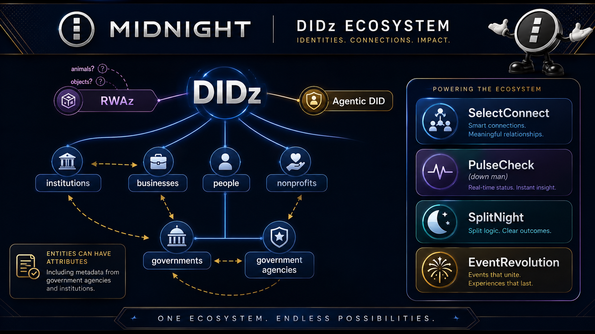

# CryptoSure 👉

> **Insurance you can prove, priced by who you are — without revealing who you are.**

Part of the **[DIDz ecosystem](https://github.com/bytewizard42i/DIDzMonolith)**.

---

## What Is CryptoSure?

CryptoSure is a **privacy-preserving insurance protocol** on Midnight. It covers two
worlds:

1. **Everyday insurance** (`CryptoSure.pro`) — the ordinary things people insure in the
   physical world: devices, gadgets, bikes, instruments, small valuables, event/ticket
   protection, rental deposits, and other everyday risks. Policies are underwritten with
   ZK proofs so the insurer learns *eligibility and risk class* without learning the
   policyholder's identity or full asset inventory.

2. **Crypto wallet insurance** (`CryptoSure.app`) — coverage for self-custodied crypto
   wallets against a defined, honest set of loss events (see the scope doc — we are
   explicit about what is and is **not** covered). Coverage is sold in fixed tiers:
   **$500 · $1,000 · $5,000 · $10,000 · $25,000 · $50,000**.

The premium you pay and the maximum coverage you can buy are influenced by your
**DIDz credit score** — a privacy-preserving reputation signal proven in zero knowledge.
Higher score → lower premium and higher available cap. The insurer verifies the score
band without seeing the underlying signals or your identity.

---

## The three pillars of CryptoSure

| Area | Domain | What it does |
|------|--------|--------------|
| **Everyday coverage** | `CryptoSure.pro` | Policies for real-world items and risks, ZK-underwritten. |
| **Crypto wallet coverage** | `CryptoSure.app` | Tiered wallet insurance ($500 → $50k) against a defined loss set. |
| **CryptoSure-EDU** | both | Wallet-hygiene certification. **Suggested** for low tiers, **required** (and signed by the wallet holder) to activate high tiers. |

---

## CryptoSure-EDU: earn your coverage

Insurance for self-custody is only honest if the insured understands self-custody. So
CryptoSure gates the larger tiers behind a **certification**:

- **Curriculum**: wallet hygiene, seed-phrase custody, phishing/approval-drainer
  awareness, hardware-wallet use, recovery planning, and — critically — **what the policy
  is and is not responsible for**.
- **Low tiers ($500, $1,000)**: EDU is **suggested**. A completed cert lowers the premium.
- **High tiers ($5,000 and up)**: EDU is **required**. The certification must be
  **cryptographically signed by the wallet holder** (proving they read and accepted the
  scope and their responsibilities) before the policy can be **activated**.
- The cert is issued as a **DIDz attestation** from an approved CryptoSure-EDU issuer and
  proven in zero knowledge at policy activation — the insurer confirms "holder is
  certified and signed the current scope" without seeing the holder's identity.

See [`docs/CRYPTOSURE_EDU.md`](docs/CRYPTOSURE_EDU.md).

---

## Why Midnight?

Insurance is a data-maximalist industry: to price and pay a policy, insurers historically
demand identity, full asset disclosure, location, and history. Midnight inverts that.

| Requirement | Traditional insurer | CryptoSure (Midnight) |
|-------------|--------------------|------------------------|
| Underwriting | Full PII + asset disclosure | ZK proof of risk class + score band |
| Identity | Required | Never revealed; DIDz commitment only |
| Credit/reputation | Bureau pull, full history | ZK proof of DIDz score band (one bit of "≥ tier") |
| Certification | Paper/PDF, unverifiable | DIDz attestation, ZK-verified, holder-signed |
| Premium pool | Opaque insurer balance sheet | On-chain shielded pool (Treasury/Pot pattern) |
| Claims | Adjuster sees everything | ZK claim proof + selective disclosure to adjuster only |
| Payout | Trust the insurer | On-chain escrow release from the pool |

---

## Architecture (one paragraph)

A **premium pool** (shielded Treasury/Pot) accumulates premiums. A **policy** is a
commitment binding a policyholder DIDz, a coverage tier, a scope hash (the exact
"what's covered" text they accepted), and — for wallet policies — an EDU certification
commitment. **Underwriting** verifies a DIDz credit-score band in ZK to set premium and
cap. **Activation** (high tiers) requires a holder-signed EDU cert proof. A **claim** is a
ZK proof that a covered loss event occurred, with selective disclosure to an adjuster;
an approved claim triggers an **escrow-style payout** from the pool. All identity, asset,
and score details stay off-chain as commitments; only status bits and pool balances are
public.

Full detail in [`docs/ARCHITECTURE.md`](docs/ARCHITECTURE.md).

---

## Built on DIDzM (we reuse, we don't reinvent)

| DIDz product | What CryptoSure borrows |
|--------------|-------------------------|
| **DIDz.io** | Policyholder identity as a commitment; selective proofs; the **DIDz credit score** signal. |
| **AgenticDID** | Agent-run policies (an authorized agent buys/manages coverage under a spend-capped grant); credit score affects an agent's delegated caps. |
| **RWAz** | Real-world-asset registry entries as the *insured object* for everyday coverage; RWA value + score feed the cap. |
| **KYCz** | Optional higher-assurance underwriting for the largest tiers (regulated path). |
| **SCIFz** | Nullifier + Merkle-membership + revocation + audit primitives for claims/anti-double-claim. |
| **TrustedIssuerRegistry** (DIDz) | Approves CryptoSure-EDU certification issuers by domain + assurance tier. |
| **EncryptVault** | Wallet-ownership proofs tied to the insured wallet. |
| **ZKSplunk** | Observability cornerstone — monitors proof server, wallet, contracts; zkZap threat detection; tamper-evident on-chain attestation of claims telemetry. |

See [`docs/DIDzM_REUSE.md`](docs/DIDzM_REUSE.md) and [`docs/ECOSYSTEM_COORDINATION.md`](docs/ECOSYSTEM_COORDINATION.md).

This project is included in the private [EnterpriseZK Labs repository landscape](https://github.com/bytewizard42i/DIDzMonolith/blob/main/DIDzMonolith-docs/ENTERPRISEZK_LABS_REPOSITORY_LANDSCAPE.md).

---

## Repo layout

| Path | Purpose |
|------|---------|
| `docs/CONCEPT.md` | The idea, the two worlds, the honesty model. |
| `docs/ARCHITECTURE.md` | Premium pool, policy, underwriting, activation, claim, payout. |
| `docs/INSURANCE_TIERS.md` | Everyday coverage + crypto wallet tiers, EDU gating per tier. |
| `docs/CRYPTOSURE_EDU.md` | Certification curriculum, holder-signed activation, ZK verification. |
| `docs/DIDZ_CREDIT_SCORE.md` | How the DIDz credit score sets premium + cap; DIDz/AgenticDID/RWAz integration. |
| `docs/DIDzM_REUSE.md` | What we lift from the DIDz family first. |
| `docs/PILOT_JURISDICTION.md` | Historical jurisdiction analysis, now superseded by the current Pennsylvania-first launch path. |
| `docs/PARTNERS_AND_LIQUIDITY.md` | LP strategy, partner categories, open call for forensic recovery partners. |
| `docs/PARTNER_CONTACTS.md` | Contact directory: blockchain forensics firms, gaming asset insurers, LPs, brokers. |
| `docs/FORENSIC_RECOVERY.md` | Crypto immutability/trackability as natural insurance fit; forensic recovery pipeline + case studies. |
| `docs/GAMING_ASSET_INSURANCE.md` | Less-regulated pilot: insuring in-game digital assets against accidental loss. |
| `docs/ECOSYSTEM_COORDINATION.md` | How DIDz + AgenticDID + RWAz + ZKSplunk form the cornerstone of CryptoSure opsec and forensics. |
| `docs/DEMOLAND_VS_REALDEAL.md` | demoLand vs realDeal convention: provider architecture, mode switching, ecosystem connections. |
| `docs/ONBOARDING_TEMPLATE.md` | 5-step new client onboarding: DIDz identity → coverage → EDU → agent delegation → confirm. |
| `docs/AI_INTEGRATION.md` | Phased AI plan: rule-based pre-screening → LLM recommendations → conversational assistant → AI underwriting. |
| `docs/CONTRACTS_OVERVIEW.md` | Quick reference for all 4 contracts: circuits, types, privacy model, ecosystem integration. |
| `docs/COVERAGE_SCOPE.md` | The actual policy scope text (v1.0.0). Hashed as scopeHash in every policy. 4 covered events, 10 exclusions, 6 conditions. |
| `docs/LAUNCH_UNDERWRITING_AND_REGULATION.md` | Launch deep dive for the $500, $1k, $5k, and $10k tiers: pricing hypothesis, underwriting partners, regulation, recovery economics, and rollout plan. |
| `docs/PA_BUSINESS_AND_UNDERWRITER_PLAN.md` | Current PA legal, licensing, underwriter-attraction, team, credential, and 90-day execution plan for EnterpriseZK Labs LLC. |
| `docs/PLAIN_ENGLISH_INSURANCE_ROLES.md` | Layman-friendly definitions of carrier-backed insurance, underwriters, producers, brokers, Managing General Agents (MGAs), reinsurers, claims administrators, and forensic partners. |
| `docs/PA_PRODUCER_EXAM_STUDY_GUIDE.md` | Beginner-friendly prerequisites, study plan, exam snapshot, and post-exam licensing sequence. |
| `docs/WEBSITE_DEMOLAND_SPEC.md` | Public-site audience, content, interaction, compliance boundary, and launch specification. |
| `docs/PRODUCT_IDEAS_BACKLOG.md` | Prioritized product concepts across the initial pilot, distribution, recovery, and longer-term platform. |
| `docs/BUILD_LOG.md` | Build checkpoints, responsive typography baselines, browser text-size preferences, and validation notes. |
| `ref-docs/` | Indexed third-party sources of truth, including Pennsylvania Keystone Smart Launch. |
| `contracts/` | Compact smart contracts (PremiumPool, PolicyRegistry, EduCertifier, ClaimEngine). Written + compile-validated. |
| `frontend-landing/` | CryptoSure.pro public DemoLand landing page with customer and insurance-provider paths. |
| `frontend-demoland/src/sdk/` | TypeScript SDK: contract types, client classes, multi-tx orchestration helpers. |
| `frontend-demoland/src/providers/realdeal/` | realDeal provider implementations (9 files wiring UI to SDK contract clients). |
| `frontend-demoland/` | Vite + React + Tailwind demoLand frontend with all pages (login, signup, dashboard, onboarding, policies, claims, EDU, pool, AI assistant). |
| `frontend-landing/` | Public CryptoSure.pro landing site with separate customer and provider paths. CryptoSure.app remains the future policy application. |
| `ROADMAP.md` | Phased plan from concept to demo. |

---

## Status

Contracts written + compiled locally with full ZK keys (2026-07-06). All 4 Compact contracts
(PremiumPool, PolicyRegistry, EduCertifier, ClaimEngine) compiled via `compact compile`
(compact CLI 0.5.1, compactc 0.31.x) with full ZK proving/verifying keys generated. TypeScript SDK layer
built (contract types, client classes, multi-tx orchestration). realDeal provider
implementations written (9 files, throw until `@midnight-ntwrk/sdk` is installed).
demoLand frontend fully functional (Vite + React + Tailwind, 9 pages, 9 mock providers).
Next: install @midnight-ntwrk/sdk, wire realDeal providers to actual SDK calls, deploy to local Midnight stack.

demoLand/realDeal: this repo follows the DIDzMonolith demoLand convention (amber
`🎭 DEMO MODE` banner, 7-auth-method standard) for any web frontend.

## Author

John M.P. Santi — EnterpriseZK Labs; Midnight Ambassador. Part of the DIDzMonolith
(DIDzM) ecosystem.

---

## DIDz Ecosystem

This project is part of the DIDz ecosystem — a suite of privacy-preserving identity,
credential, and application tools built on Midnight Network.

See the full ecosystem map above, or visit [didz.io](https://didz.io) for details.
